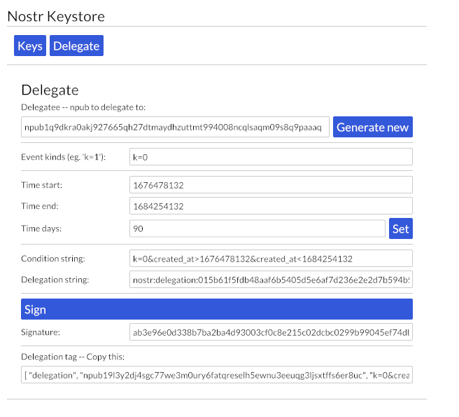

# **Keystr**: Nostr Keystore

An application for managing Nostr keys.
Written in Rust, with simple UI (Iced).

## Features

- Safekeeping of keys:
  - Import of keys (secret or public)
  - Save/Load keys (encrypted with password)
- Delegations: Create NIP-26 delegation
- Signer (Nostr Connect) support:
  - connect to a client (handle internal requests (describe, get public key))
  - Show popup for handling incoming Sign requests

## Screenshot

## Roadmap

- Profile metadata
- Android app

## Building and Running

- Prerequisite: `rust`, v >= 1.67

- Simply run:  `cargo run`

## User Guide

Short description of available functionalities.

### Key Management

**Keys Overview**

A Nostr identity should be set in the app, that is, a pair of keys: a secret key and corresponding public key.
It is possible to provide only pubkey, in this case signing will not work.

It is possible that no key is set (e.g. after first startup or after clearing the keys).

If an password-encrypted key is loaded from storage, but password is not provided, singing will not work.

**Importing Keys**

- Generate new key pair
- Import a private key (nsec or hex string)
- Import a public key (npub or hex string)

**Saving/Loading Keys**

Secret key can be persisted to disk, in encrypted form.
Encryption can optionally use a password.

Files are stored in local data directory, under `~/.local/share/keystr` in Unix.

When an encrypted password is loaded, it becomes usable only once it is unlocked, using the password used during encryption. (Note: Unlock can happen later after load.)

**Security Setting**

There is a general security setting controlling the security of secret key storage, with following options:
- Never persist security key
- Persist but only with a password-enhanced encryption (The password is needed every time the key is loaded)
- Persist encrypted, with or without a password

### NIP-26 Delegations

It is possible to create a NIP-26 Delegation, to empower a delegatee identity to be able to post events in the name of the loaded identity.

Typical flow, assuming the a key pair is loaded:

- Enter (paste) the npub of the delegatee (typically taken from another Nostr client app)
- Optionally set time range, this can be done using a number of days from now (or using absolute unix timestamps)
- Optionally enter an event type restriction, e.g. 'kind=1'
- Create the delegation. The resulting delegation tag should be copied to the other client app.

### NIP-46 Nostr Connect a.k.a Signer

Keystr can act as a Signer, and sign event for a client.

- Enter a nostrconnect URI string
- Keystr will connect to the relay and listen for signer requests
- For incoming Signing requests it shows a popup for the user, to review and acknowledge (sign) it

## Running Tests

- `cargo tests`

## Contributing

Create an issue, PR, or discussion.

## License: MIT

## References

- NIP-26 Delegations Spec https://github.com/nostr-protocol/nips/blob/master/26.md
- NIP-26 Delegations Status  https://hackmd.io/fskWGX_XRxG45fMrub8OiA?view
- NIP-26 Delegations Spec https://github.com/nostr-protocol/nips/blob/master/46.md
- Rust-nostr lib  https://github.com/rust-nostr/nostr
- NostrTool, key generation and delegation playground  https://github.com/kdmukai/nostrtool
- Nostr Protocol definition  https://github.com/nostr-protocol/nostr  protocol
- Nostr projects  https://github.com/aljazceru/awesome-nostr

## Contact

Nostr: optout@nostrplebs.com npub1kxgpwh80gp79j0chc925srk6rghw0akggduwau8fwdflslh9jvqqd3lecx
